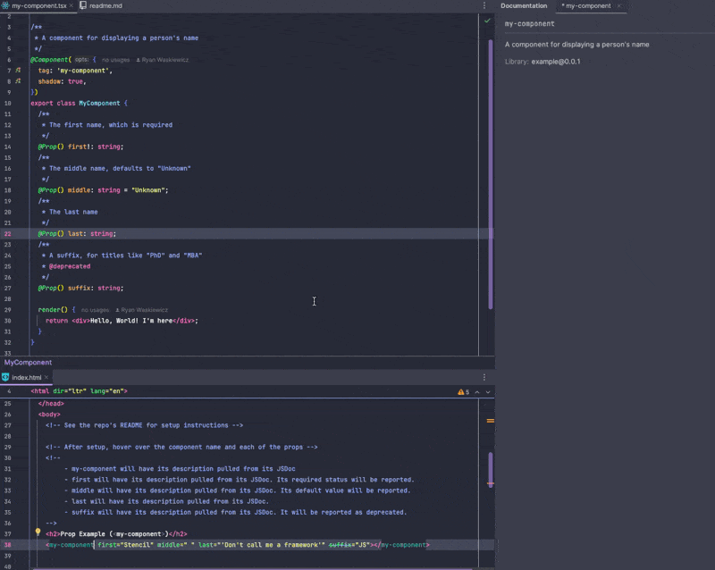

# Stencil Web Types Output Target

<p align="center">
  <a href="https://www.npmjs.com/package/@stencil-community/web-types-output-target">
    </a>
  <a href="https://github.com/ionic-team/stencil/blob/main/LICENSE.md">
    
  </a>
  <a href="https://github.com/stencil-community/stencil-web-types/blob/main/CONTRIBUTING.md">
    
  </a>
  <a href="https://twitter.com/stenciljs">
    
  </a>
  <a href="https://chat.stenciljs.com">
    
  </a>
</p>

A Stencil output target for generating [web types](https://plugins.jetbrains.com/docs/intellij/websymbols-web-types.html#file-structure) to provide intellisense for Stencil components in HTML and Vue files.

> [!NOTE]
> This package follows [semantic versioning](https://semver.org).
> Small breaking changes to the API may occur prior to hitting v1.0.

## Overview

One of the core features of web components is the ability to create [custom elements](https://developer.mozilla.org/en-US/docs/Web/Web_Components/Using_custom_elements).
When Stencil compiles a project, it generates a custom element for each component in the project.

By default, integrated development environments (IDEs) like JetBrains' WebStorm are not aware of a project's custom elements, resulting in a poorer development experience.

The `webTypesOutputTarget` output target tells Stencil to generate a JSON file that enables auto-completion, hover tooltips, etc., for a project's custom elements in HTML and Vue files.
Once the feature is enabled and your IDE is informed of the JSON file's location, web components in HTML and Vue files will have similar Intellisense to that of TSX files:

<div align="center">
    
</div>

## Set Up

The output target is not built into Stencil itself.
It's a third party package, that needs to be installed as a dev-dependency:
```bash
$ npm i --save-dev @stencil-community/web-types-output-target
```

To generate custom element information for JetBrains IDE's, add the `webTypesOutputTarget` output target to your `stencil.config.ts`:
```tsx
import { Config } from '@stencil/core';
import { webTypesOutputTarget } from '@stencil-community/web-types-output-target';

export const config: Config = {
  outputTargets: [
    webTypesOutputTarget(),
  ]
};
```

Stencil will write a `web-types.json` to your project's root directory the next time the Stencil [build task](https://stenciljs.com/docs/cli#stencil-build) is run.

## Configuration

The `webTypesOutputTarget` output target takes an optional argument, an object literal to configure the output target.
The following are properties on that configuration object.

### `outFile`

Defaults to `StencilConfig#{rootDir}/web-types.json`.

Since [v0.3.0](https://github.com/stencil-community/stencil-web-types/releases/tag/v0.3.0).

Description: A string that represents location of the file generated by this output target.
Users may specify any of the following:
- A relative directory (e.g. `'../'`)
- A filename (e.g. `'my-types.json'`)
- A relative directory ending in a filename (e.g. `'../my-types.json'`).

It is not recommended to use absolute paths for this setting, as this can cause errors in projects shared by more than one developer/environment.
An error will be logged to the console if an absolute path is detected.

Any relative file path provided will be relative to the 'root directory' of your Stencil project.
By default, this is the directory your project's `stencil.config.ts` is in.

If the value provided does not end in `'.json'`, the output target assumes that a filename must be added to the path.
In such cases, the default name, `'web-types.json'`, will be added to the path:
- `../` will be transformed to `../web-types.json`
- `./web-types` will be transformed to `./web-types/web-types.json`
- `./my-types.json` will not be transformed, as the provided value ends in `'.json'`

## Using Web Types

Once web types have been written to disk, they need to be picked up by the IDE.
Web types for your project can be picked by JetBrains IDEs by setting the `web-types` property at the root level of your project's `package.json` file:

```json
{
  "name": "your-projects-name",
  "version": "1.0.0",
  "//": "Other details omitted",
  "web-types": "./web-types.json"
}
```

Having this file locally on disk will allow your JetBrains IDE to pick up additional typings automatically.
To provide these IDE-specific typings to users of your library, be sure to include the generated web types file in your package's distributable by adding it to your `package.json#files` array.

## References

https://plugins.jetbrains.com/docs/intellij/websymbols-web-types.html#file-structure
